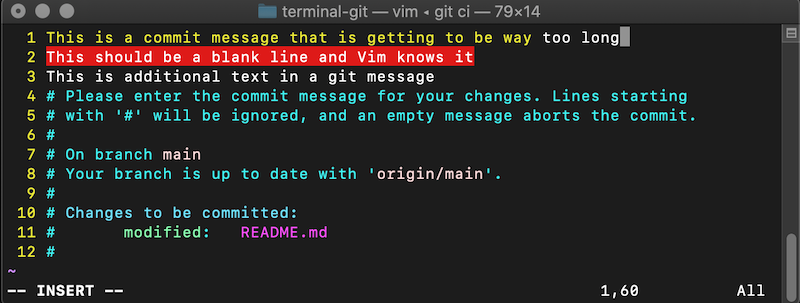

# Terminal Zoo
A workshop designed to give students a hands-on introduction to useful terminal commands/tools as well as some tips for using Git.

## Must Know Terminal Commands
_Thank you to [Onno Schwanen](https://github.com/0nn0) and their [terminal cheatsheet repo](https://github.com/0nn0/terminal-mac-cheatsheet)_

| Key/Command | Description |
| ----------- | ----------- |
| cd [folder] | Change directory e.g. `cd Documents` |
| pwd | Path to working directory |
| ls | Short listing |
| ls -a | Listing incl. hidden files |
| touch [file] | Create a file | 
| rm [file] | Remove a file |
| cp [file] [newfile or dir] | Copy file to file or directory|
| mv [file] [new filename] | Move/Rename file |
| mkdir [dir] | Create new directory |
| rmdir [dir] | Remove directory ( only operates on empty directories ) |
| rm -r [dir] | Remove directory and contents  | 
| open [file] | Opens a file as if you double clicked it | 
| sudo [command] | Run command with the security privileges of the superuser (Super User DO) |

> _NOTE: With most commands you can get help if you forget how to use them just type 'help' before the command. ex `help cd`  For some commands you have to use `info` instead.
## Terminal Shortcuts

| Key/Command | Description |
| ----------- | ----------- |
| Cmd + K    | Clears the Screen |
| Ctrl + L   | Clears the Screen |
| Ctrl + C   | Kill whatever you are running. |
| Tab  | Auto-complete files and folder names |
| Option + →  | Move cursor one word forward |
| Option + ←  | Move cursor one word backward |
| Ctrl + A   | Go to the beginning of the line you are currently typing on |
| Ctrl + E   | Go to the end of the line you are currently typing on |
| Ctrl + U   | Cut everything backwards to beginning of line |
| Ctrl + K   | Cut everything forward to end of line |
| Ctrl + Y   | Paste whatever was cut by the last cut command |

## File Path Shortcuts
 Key/Command | Description |
| ----------- | ----------- |
| . | Current folder/directory ex: `ls .` |
| .. | Parent folder/directory ex: `ls ..` or `cd ..` |
| * | Wildcard ex: `ls *.js` (list any file that ends in .js) |

> I find these really handy when trying to only add some of my changed files to a commit in Git.  For example I might have a file called `monkey.js` but its two or three folders nested from my current working directory.  I can add only that file by typing `git add */monkey.js` This translates to add all files called `monkey.js` in any child directories. 
## Handy Terminal Tools
Something to remember about the terminal is it is just a different way to interact with a computer than the GUI (Graphical User Interface) that most people are used to.  The same way that you can open up the finder and navigate through folders we can do the same with the terminal using `cd`.  This also extends to applications.  You probably set up VS code sot hat when you type `code .` it will open VS Code at the current directory.  Infact you can use the `open` command to open any file from the terminal with the default program for that file type, just like if you were to double click on the file.

As I just described the terminal can be used to open files using applications that have a GUI (like VS Code) but there are also many tools (or you can think of them as apps) that are used only from the terminal.  Hopefully thinking about these tools as just apps that have a specific purpose but no GUI helps demystify them a little.  

Here are some of my most used Command Line Tools that are built in to the terminal:

### vim
Command line text editor
- Easy and quick way to create/edit a new file right from the terminal.  
- Very powerful and customizable if you choose to explore that more

### curl (cURL)
Transfer data using network protocols
- Can be used to create a quick HTTP GET request
- Can also send files and download files
- And much much more...

### ping
Send a test message to an IP address
- Easy way to quickly check if you are able to reach an IP address.

### nc (netcat)
TCP/UDP network communication tool
- Easy tool to test if a port is open (ex. `nc -vz 127.0.0.1 3000`)
- And much more...

# Build a server using only the terminal
We are going to build a simple web server using only the terminal and the terminal tools we reviewed earlier.  

## Get Started
- Fork the workshop repo from https://github.com/cchauche/terminal-git
- Let all make sure we are starting from the same place so lets first change directory to our home directory by using the command
  ```
  cd ~
  ```
- Navigate to your `Documents` directory and create a new directory called `craftOfCode`
- Move in to the newly created directory
- From github get the link to clone your repo and clone it in this directory by using the command
  ```
  git clone [Your URL Here]
  ```
- Now move in to the newly created folder `/terminal-git` and lets list all the files (including hidden files) using `ls -a`
- Next we have to install the project dependencies using
  ```
  npm install
  ```

## Create a hello world server
- Create the following directories and files using appropriate terminal commands
  ```
  terminal-git
  ├── server 
  │   └── server.js
  └── public 
      └── index.html
      └── log.js
  ```
- Using vim open the `server.js` file and paste the following code in it
  ``` javascript
  const express = require('express')
  const path = require('path')
  const morgan = require('morgan')
  const app = express()
  const port = 3333

  app.use(morgan('dev'))
  app.use('/', express.static(path.join(__dirname, '..', 'public')))

  app.listen(port, () => {
    console.log(`Example app listening at http://localhost:${port}`)
  })
  ```
- Next use vim again to open the `index.html` file and paste in the following code
  ```javascript
  <!DOCTYPE html>
  <html>
      <head>
          <title>Hello</title>
          <script src="log.js" defer></script>
      </head>
      <body>
          <h3>Hello World!</h3>
      </body>
  </html>
  ```
- Lastly lets open the `log.js` file and add a console log statement to the file. 
- Now lets run the server to test out what we've done. Navigate back to the root directory and from there lets use node to run our javascript file.
  ```
  node server/server.js
  ```
- You should see a message in your terminal along the lines of 'Example app listening at http://localhost:3333'
- Lets use netcat and curl to test that our server is running
  - Use netcat to test if port 3333 is open
    ```
    nc -vz localhost 3333
    ```
  - Next use curl to test that the server is returning the html file
    ```
    curl http://localhost:3333
    ````
- Congratulations! You have made a working server using only the terminal!

# Working with Git

## Making Commits
Now that we have a working server lets create a new commit, but wait there are a bunch unstaged changes and we want to make small targeted commits so lets explore different ways of staging files using `git add`

- You are probably already familiar with `git add .` which adds everything in the current directory (and all sub-directories) but you can use other shortcuts as well
- Lets stage just the files in the public directory by typing `git add public/`
- Lets remove all the staged files using `git restore --staged .`
## Stage Only Files of One Type
- Next stage only the javascript files with `git add *.js`
  - The wildcard `*` can be added in other ways as well for example `*/index.*` would add any files called 'index' of any file type in any subdirectory.
- Lets once again unstage all our files and now create two commits

## Create Two Smaller Commits
- First create a commit that only includes the `/public` directory and give it a good name like 'Add index.html and log script'
- Second create a commit with everything else and give it a name like 'Add express server for static file serving'
- Commit messages should be relatively short less than 72 characters ideally less than 50 and use the imperative mood (ex Add instead of Added)
  - You can also think of it as finishing the sentence '_This commit will..._ Implement addition function'
  - For great guide on making good commit messages and why it's important check out https://chris.beams.io/posts/git-commit/

## Making A Branch
Lets explore branching which is one of the things that makes Git so amazing! We have decided that our Hello World app just isn't impressing our clients the way it used to.  One of the product managers suggested converting the app in to a zoo app with many animals and the sounds that they make.  Corporate thought it was a great idea and wants us to run with that but we want to keep our current app un-touched while we refactor it in to a zoo app.  We will do this by creating a new branch.

- First have a look at your current branches by using `git branch`
- Next have a look at your commit log with `git log` to get familiar with what the commit history looks like.
- Lets create a new branch called 'zoo' `git branch zoo`
- Lets switch to the new branch by using `git checkout zoo`
  - You can also create a new branch and immediately switch to it by using `git checkout -b [branchName]`
- Lets look at the log again.  Notice that no new commits have been added but the most recent commit has both branch names next to it.
- Lets refactor `index.html` so it says 'Hello Zoo!' instead
- Now make a new commit with all the changed files
- Look at the git log again and notice the new commit only has one branch name and it also is marked as the HEAD
- The big wigs at corporate have sent an urgent message, it seems they have a problem with the console log and want it to be immediately changed over to 'Hello World!' to better match the current brand.
- Lets make sure we don't have any unsaved changes with `git status` then lets switch back over to the main branch `git checkout main`.
- In `log.js` lets change the console log to 'Hello World!' and then make a new commit with all the files.
- Lets switch back over to our zoo branch `git checkout zoo` to add our first animal
- Create a directory `public/felines` and make a file called `lion.txt` with the text 'ROAR' inside. (Make sure there is a blank line at the end)
- Lets test our new zoo app using curl
  ```
  curl http://localhost:3333
  ```
  ```
  curl http://localhost:3333/felines/lion.txt
  ```
- Lets make another commit with all our new files along the line of 'Add felines'
- Everyone loves the new zoo app and its time to merge our new feature in to the main branch.
  - First lets merge our most recent changes to main in to our feature branch `git merge main`
  - Next switch back to the main branch and `git merge zoo`

## Explore More Git
Feel free to keep exploring git using this repo, (please feel free to use VS Code or your preferred editor) some commands/actions I might recommend you learn more about are:
 - Using git checkout to checkout a specific commit and then get back to where your branch is
 - `git restore` to restore changes you made to a file
 - `git commit --amend` to amend the last commit (be warned not to amend a commit you have pushed to gitHub)
 - `git reset --soft HEAD~1` removes the last commit but keeps all the changes
    - reset also has --hard and --mixed (default) option that might be worth learning about

# Command Line Resources

### Terminal
- [Mac Terminal Cheat Sheet](https://github.com/0nn0/terminal-mac-cheatsheet)
- [NetCat Cheat Sheet](https://kapeli.com/cheat_sheets/Netcat.docset/Contents/Resources/Documents/index)
- [curl](https://curl.se/) - official website
  - [curl Examples](https://curl.se/docs/manual.html) - A bunch of examples from the docs
- [A Great Vim Cheat Sheet](https://vimsheet.com/)

### Colin's Vim Customization
These customizations add some handy features to the vim interface that I find make it easier to work with. The syntax highlighting I find especially handy as it will tell you when your git commit is getting too long. It will also apply highlighting if you open a JavaScript files and others.



In your home directory create a `~/.vimrc` file if it doesn't already exist.  Inside that file add the code below. (Note these instructions are all for Mac it may be slightly different on Linux or Windows)
```vim
  "This is in here because it automatically wraps lines after 72
  "characters when making a git commit
  filetype indent plugin on

  "syntax highlighting
  syntax on

  " Show line numbers
  set number

  " Show file stats
  set ruler

```

### You don't get it I want to be a terminal wizard
- [Introduction to Bash, VIM & REgex with Substack](https://frontendmasters.com/courses/bash-vim-regex/) - Frontend masters course (ATM HR grads get a free trial)
- [Ink](https://github.com/vadimdemedes/ink) - Build command line tools with React
- [Yarg](http://yargs.js.org/) - Build command line tools with JS
- [fesh](https://github.com/armandogj1/fesh) - Fetch interface for terminal built with Yarg by former SEIR [Armando](https://github.com/armandogj1)


# Git Resources
- [Atlassian Git Cheat Sheet](file:///Users/Colin/Downloads/SWTM-2088_Atlassian-Git-Cheatsheet.pdf)
- [Creating command aliases](https://stackoverflow.com/questions/2553786/how-do-i-alias-commands-in-git) (ex git co instead of git checkout)
- [Set vim as default Git editor](https://stackoverflow.com/questions/2596805/how-do-i-make-git-use-the-editor-of-my-choice-for-commits)
- [Pro Git Book](https://git-scm.com/book/en/v2) - This is basically the Git Docs
- [How To Write A Good Git Commit Message](https://chris.beams.io/posts/git-commit/) 
- [Git Training Repo](https://github.com/UnseenWizzard/git_training)
  - Another repo with really good explanation of how git works
- Interactive Tools to Learn Git
  - [Visualizing Git](http://git-school.github.io/visualizing-git/)
  - [Learn Git Branching](https://learngitbranching.js.org/)
  - [O'Reilly Learn Git Interactive](https://www.katacoda.com/courses/git)
- [Git and Github in Plain English](https://blog.red-badger.com/2016/11/29/gitgithub-in-plain-english)
- [Git Flight Rules](https://github.com/k88hudson/git-flight-rules#i-want-to-list-all-branches) - What to do when things go wrong

